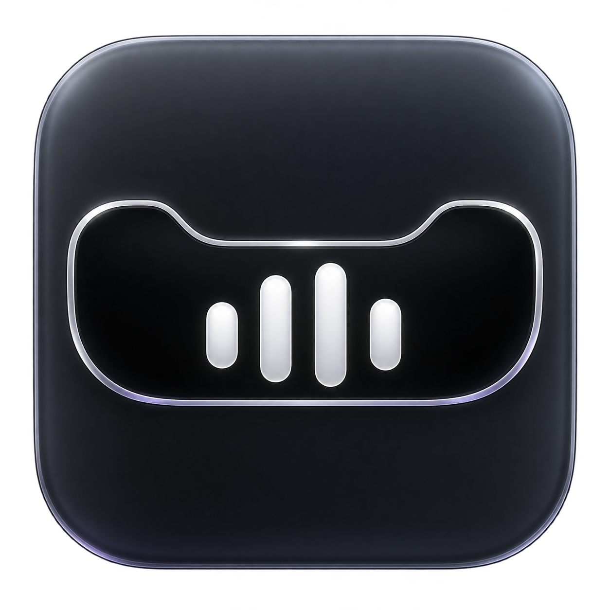

<div align="center">
  

  <h1>Undertone</h1>
  <p>A Spotify player that brings your Mac’s notch to life.</p>
  <p><strong>Made by Reuben Agbaje</strong></p>
</div>

Undertone turns the notch into a compact music player with a real Spotify-reactive waveform, fluid swipe gestures and playback controls. Hover to reveal your music, swipe to change tracks, and keep your desktop clear when playback stops.

Built with **Swift, SwiftUI and AppKit** for macOS.

## Features

- **Notch-first design** — artwork and a live waveform sit beside the camera, expanding into a full player when you hover.
- **Spotify-only waveform** — responds to audio from the Spotify desktop app, rather than a decorative animation or the whole system mix.
- **Playback controls** — play/pause, previous/next, seeking and shuffle, with artwork, track information and progress.
- **Reversible swipe gestures** — drag to preview an action, release past the threshold to commit, or drag back to cancel.
- **Spotify Liked Songs** — like and unlike tracks in Spotify after connecting your account.
- **Song previews** — larger, bold captions after track changes, scrolling text for longer names and explicit badges when available.
- **Fluid interaction** — animated artwork transitions, elastic swipe feedback, circular button highlights and optional trackpad haptics.
- **Custom appearance** — optional black-to-Liquid-Glass background, soft shadows, a thin outline without a top border, and adjustable compact top corners.
- **Quiet when idle** — hides behind the notch when playback stops; hover just beneath the camera to bring it back.

## New in v1.26

The expanded player now has a Tools panel for countdown timers, downloads, a drag-and-drop file shelf and audio output switching. Optional battery and AirPods/Beats notices appear in the island. General settings add Apple Music and compatible Safari/Chrome active-tab playback; Modules adds display placement, size presets, animation intensity and presentation mode. Brightness popup replacement joins volume replacement under General → Volume indicator and needs Accessibility permission.

See [feature setup and limitations](NEW-FEATURES.md) before using browser playback or hardware-specific features. Not every browser site or Bluetooth device exposes the necessary information.

## New in v1.25

Appearance → Display style → Dynamic Island adds a floating pill with adjustable distance below the menu bar. It retains the player, queue, gestures and volume/brightness indicators. General → Volume indicator → Replace macOS volume popup optionally intercepts volume keys after Accessibility permission; click Allow Accessibility, grant permission, then Retry. This does not suppress the brightness popup. See [feature notes](NEW-FEATURES.md).

## New in v1.24

- Fuller volume and brightness indicators extend directly from the notch when system levels change, with rounded corners and more room around icons and percentages.
- **Always show notch** in Appearance keeps an idle island visible on notchless Macs too.
- A queue button beside the heart expands the notch into a scrollable Spotify Up Next list.
- General settings include a sleep timer, launch at login, keyboard shortcuts, and signed Sparkle updates.
- Optional artwork colour accents complement the existing Liquid Glass appearance.

Enable **Settings → General → Updates → Automatically check for updates**. Automatic download/installation is a separate option. Older versions without Sparkle need a manual installation first. Queue access may require reconnecting your Spotify account once to grant playback-reading scopes. The macOS system level indicator is not suppressed.


## Now Playing and Settings dashboard

Native General / Modules / Appearance settings include automatic Spotify reconnection and an iOS-inspired lock-screen player. Tap artwork to fill the screen, then tap again to collapse. Move the pointer into the lower password area to reveal the native prompt. Optional Liquid Glass, artwork ambience and imported timed lyrics are available in Settings → Modules.

Lock-screen visibility was confirmed on the development Mac. It uses private SkyLight APIs and may vary with macOS versions. Lyrics use imported `.lrc` files, not Spotify's lyrics service. See [integration and platform details](LOCK-PLAYER-INTEGRATION.md).

## Requirements

- macOS **13 or later**.
- The **Spotify desktop app** installed on your Mac.
- Local Spotify playback for the reactive waveform. Spotify Connect playback on another device and Spotify in a browser are not captured.
- A compatible trackpad for two-finger gestures and haptic feedback.

A notched MacBook gives the intended appearance. On displays without a notch, Undertone uses a top-centre island. Native Liquid Glass requires macOS 26 or later; older systems use translucent material. Reduce Motion and Reduce Transparency settings are respected.

## Installation

1. Download [Latest Undertone release](https://github.com/reubenagbaje/Undertone/releases/latest).
2. Unzip it and move **Undertone.app** to Applications.
3. Open Undertone, then open Spotify and play a song.
4. Undertone connects to Spotify automatically. Approve Automation access if requested; use **Settings → General → Retry connection** after resolving a permission denial.
5. Enable **Spotify audio** in Settings and grant the requested macOS permissions.

Undertone runs without a Dock icon. Hover near the upper-right of the expanded player to reveal the **…** settings button. This opens the native Settings window, also available with **⌘,** while Undertone is active. Settings contains General, Modules and Appearance tabs, plus **Quit Undertone**.

The supplied build is locally signed and **not notarized**, so macOS may require an explicit opening confirmation. Only open downloads you trust. For updates, quit the old copy before replacing it.

## Controls

| Action | Result |
| --- | --- |
| Briefly hover over the notch | Compact player gently enlarges |
| Keep hovering over the centre | Full player opens |
| Swipe left | Next track |
| Swipe right | Restart the current track after three seconds; otherwise previous track |
| Drag back before releasing | Cancel the swipe if below the threshold |
| Click the heart | Like or unlike the track in Spotify, after account connection |
| Click or drag the progress bar | Seek within the track |
| Move away after swiping, then return | Enable hover expansion again |

**Reverse swipe direction** swaps the swipe actions. **Keep player expanded** pins the player open; swiping still collapses it.

## Connect Spotify Liked Songs

Desktop playback controls work separately from the optional Spotify account connection. Liked Songs and explicit-track metadata use Spotify’s Web API.

1. Create or open an app in the [Spotify Developer Dashboard](https://developer.spotify.com/dashboard).
2. Add this exact redirect URI:

   ```text
   http://127.0.0.1:43821/callback
   ```

3. Ensure your account meets Spotify’s current developer-app access requirements and is allowed to use your app.
4. In Undertone Settings, find **Spotify Liked Songs** and paste your **Client ID**. No client secret is needed.
5. Click **Connect Liked Songs**, sign in with the account you use in the Spotify desktop app, and approve access.

Authentication uses Authorization Code with PKCE. Tokens are stored in **macOS Keychain**. The requested scopes are `user-library-read`, `user-library-modify`, `user-read-playback-state` and `user-read-currently-playing`.

See [Spotify setup and troubleshooting](SPOTIFY-SETUP.md) for more detail.

## Permissions and privacy

| Permission | Purpose |
| --- | --- |
| Automation → Spotify | Read playback information and control the Spotify desktop app |
| System Audio Recording | Analyse Spotify audio on newer macOS versions |
| Screen & System Audio Recording | Support the ScreenCaptureKit fallback on older macOS versions |

Permission labels vary by macOS version. Review them under **System Settings → Privacy & Security**.

- Audio is analysed locally. It is **never recorded, saved or uploaded**.
- The older capture fallback immediately discards screen frames.
- Core playback does not require microphone, Accessibility or Input Monitoring permission. The optional system-volume/brightness-popup replacement requires Accessibility permission. AirPods/Beats notifications may request Bluetooth access when enabled.
- Artwork and account/library requests communicate with Spotify. There is no analytics service.
- Spotify credentials are not included in the source project.

The local ad-hoc build uses the Apple Events entitlement without hardened runtime; Developer ID builds should enable hardened runtime and sign all embedded frameworks with the same identity. App Sandbox is disabled. The usage descriptions and entitlement are included in the project.

## Build from source

Open `Undertone.xcodeproj` in Xcode, select the **Undertone** scheme and **My Mac**, choose your signing team or **Sign to Run Locally**, then press **⌘R**. The project has been built with Xcode 26.6.

For a universal Release build, run from the directory containing the Xcode project:

```sh
xcodebuild -project Undertone.xcodeproj -scheme Undertone \
  -configuration Release -derivedDataPath build \
  CODE_SIGN_IDENTITY=- CODE_SIGNING_REQUIRED=NO ENABLE_HARDENED_RUNTIME=NO \
  'ARCHS=arm64 x86_64' ONLY_ACTIVE_ARCH=NO build

open build/Build/Products/Release/Undertone.app
```

Use Developer ID signing and notarization for wider distribution. Do not commit build folders, OAuth tokens or client secrets.

## Testing

```sh
./test.sh
```

Automated tests cover audio decoding and spectrum analysis, Spotify source selection, hover timing, swipe thresholds and cancellation, elastic gesture feedback, preview timing, and mocked Spotify authentication/library requests. They do not modify a real Spotify account.

For a manual check, play Spotify alongside audio from another app and confirm that only Spotify drives the waveform. Check partial swipes, reversed swipes, hover activation, seeking and a like/unlike round trip. Audio permissions, haptics, display geometry and live glass rendering also need checking on the target Mac.

## Troubleshooting

**The waveform is flat:** make sure Spotify is playing on this Mac, enable Spotify audio, check recording permission for the current copy of Undertone, then use **Restart audio**. On macOS 14.2 and later, capture waits for Spotify and reconnects when its audio processes change. Older systems may need capture restarted after Spotify reopens.

**Playback controls do not respond:** open Spotify, check Automation permission and click **Retry connection**.

**Hover does not open after a swipe:** move the pointer away, then return and hold it over the centre of the notch.

**The heart does not work:** connect Liked Songs with the same account used by the desktop app. Check the error shown in Settings and your developer app’s allowed users.

**An update requests permission again:** keep a single app copy in Applications. A new locally signed build may require renewed recording or Keychain access.

## Project structure

- `Undertone/UndertoneApp.swift` — notch panel, player, settings and animations.
- `Undertone/AudioCapture.swift` — Spotify audio capture, PCM decoding and spectrum analysis.
- `Undertone/SpotifyController.swift` — playback, metadata, artwork and transport controls.
- `Undertone/SpotifyOAuth.swift` — PKCE authentication and Keychain storage.
- `Undertone/SpotifyLibrary.swift` — Liked Songs and explicit-track metadata.
- `Undertone/HoverIntent.swift` — hover, swipe and preview behaviour.
- `Tests/` — automated regression checks.

## Credits

**Made by Reuben Agbaje.**

Undertone is an independent project and is not affiliated with or endorsed by Spotify or Apple. Spotify and Apple trademarks belong to their respective owners.

Version 1.20: Settings → Modules → Liquid Glass player enables native glass on macOS 26+, with material fallback on older systems. Reduce Transparency keeps the card opaque. The fuller card has 24 extra points of vertical padding and sits 18 points above the reserved authentication area. Its thumbnail hides and the heading widens while full-screen artwork is expanded.

Version 1.21 enlarges and strengthens the shared transport icons and progress bar. Seeking updates the displayed position immediately, disables progress interpolation while dragging, and rejects polls started before or during a seek. The next fresh poll reconciles with Spotify, including after failed seeks.
